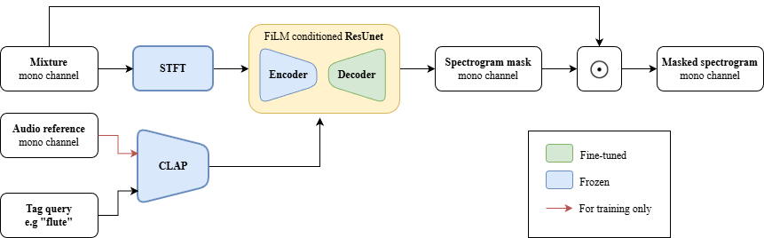

# Introduction

This page is dedicated to a project conducted within the ATIAM Master’s program. The objective of this project is to separate a trio consisting of a tenor saxophonist, a violinist, and a pianist, recorded together in an acoustic room, as if each instrument had been recorded independently. Our approach is based on the relationship between microphone placement strategies for high-quality sound recording and a source separation algorithm combining deep learning and signal processing methods.

## CLAP Language-Queried Audio Source Separation

This repository is derived of the code and models from "[Separate What You Describe: Language-Queried Audio Source Separation](https://arxiv.org/pdf/2203.15147.pdf)" [INTERSPEECH 2022].
All the modifications have been made as part of an AITAM master project dedicated to Multi-channel Acoustic Source Spearation.

<p align="center">
  
</p>

You can visit [our website](https://loguerci.github.io/CLASS_website/), where we show several audio exemples and picture from the recorded session.

### Setup 
Clone the repository and setup the conda environment: 

  ```
  git clone https://github.com/loguerci/LASS_PAM && \
  cd LASS_PAM && \ 
  conda env create -f environment.yml && \
  conda activate LASS 
  pip install laion-clap
  ```

After the setup, you need to import the proper model for CLAP (pretrained folder) :
https://huggingface.co/lukewys/laion_clap/blob/main/music_audioset_epoch_15_esc_90.14.pt

And the proper model for LASS (if you want to fine-tune the model) :
https://drive.google.com/file/d/1f8eCCYYaBdhsFqoi7PJMrT9Oo7GaWLdR/view?usp=sharing

### Inference 
To test CLASS-net, you have to :

  ```
  python separate.py
  ```

Make sure you changed the audio_path to include one of the following exemples :

  ```
  examples/dont_know_why_20.wav
  examples/hey_jude_20.wav
  examples/i_will_survive_20.wav